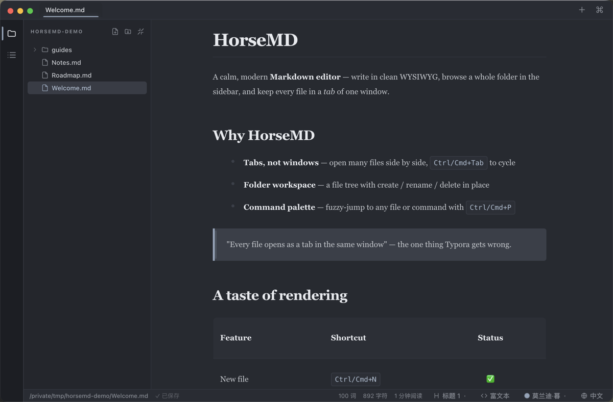
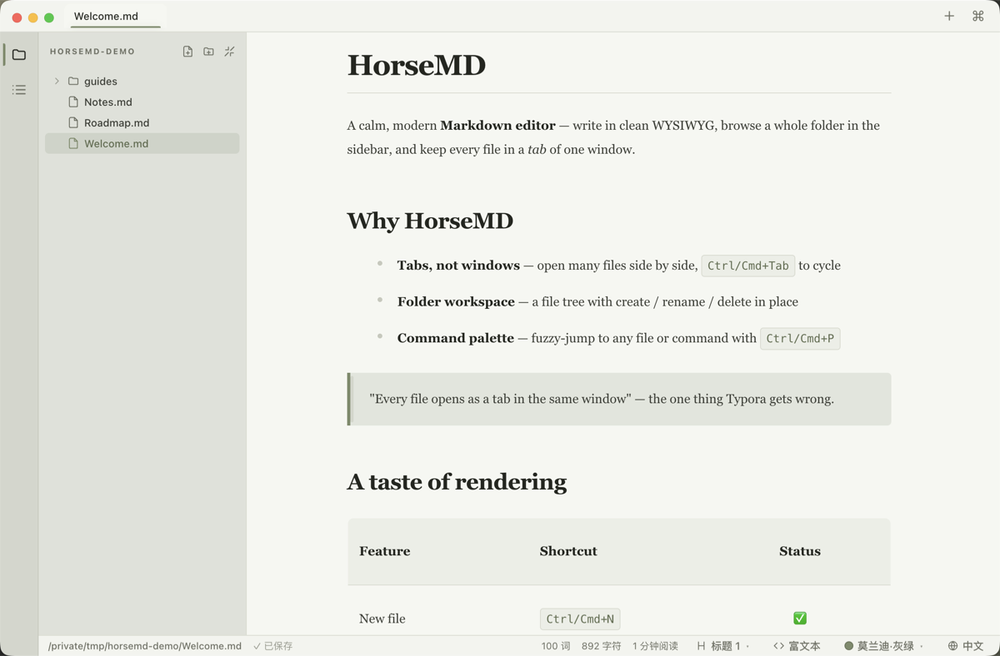
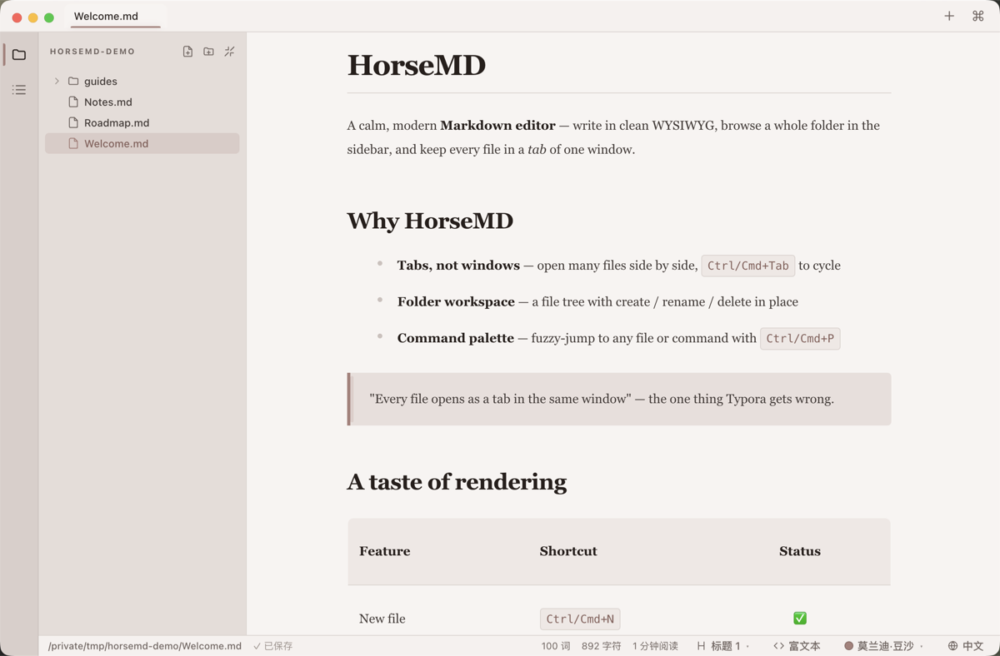
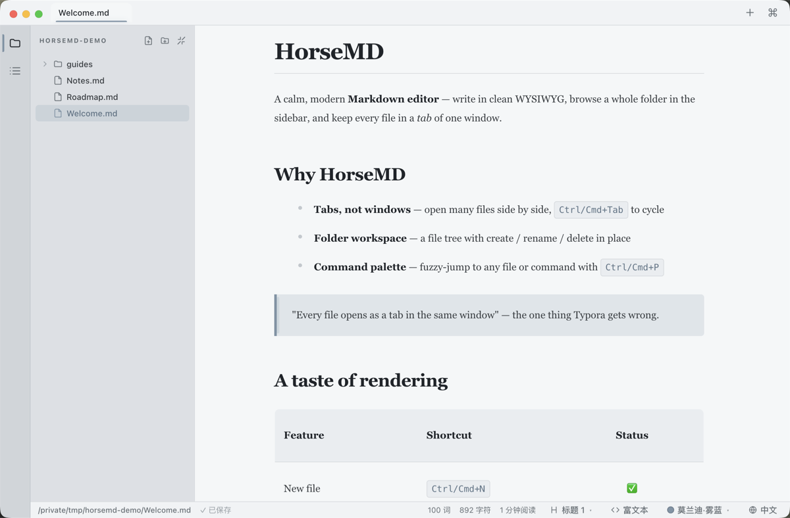

# HorseMD

[](https://github.com/BND-1/horseMD/actions/workflows/ci.yml)
[](https://github.com/BND-1/horseMD/releases)
[](./LICENSE)

**English** · [简体中文](./README.zh-CN.md)

A calm, modern **Markdown editor** — a Typora alternative built around the one
thing Typora gets wrong: **every file opens as a tab in the same window**, not a
new app instance. Browse a whole folder in the sidebar, flip between files in
tabs, and write in a clean WYSIWYG editor.


## Why HorseMD

Most Markdown editors make you choose between a beautiful WYSIWYG canvas and a
real multi-file workflow. HorseMD gives you both: a **single window** that holds
your whole folder in a file tree, every open document in a **tab**, and an
in-place live-preview editor powered by [Milkdown](https://milkdown.dev/)
(ProseMirror). It runs on **Windows and macOS** from one codebase, and the whole
interface speaks both **English and 中文**.

## Features

**Editing — everything Typora has**

- Seamless **WYSIWYG live preview** — type Markdown, see it render in place
- Slash menu (`/`) for inserting blocks; smart lists, selection toolbar, link tooltips
- Tables, fenced **code blocks with syntax highlighting**, **LaTeX math**, images, task lists, blockquotes
- **Source mode** toggle (`Ctrl/Cmd+/`) for raw Markdown — keeps scroll position
- **Plain-text files (`.txt`) open in a fast plain editor** — no markdown reflow, instant on huge files
- Rich-text copy with inline styles (paste into WeChat / email / Notion keeps formatting)
- **Export to PDF** (`Ctrl/Cmd+Shift+E`) — clean print layout, no editor chrome
- Relative-path images resolve against the file's folder (display only — your file stays untouched)
- **Raw HTML tables** (`<table>…</table>` in the Markdown) render as real tables, like Typora — display only, the source is preserved
- A floating **block-level badge** tracks the caret (H1…H6 / Text)

**Beyond Typora**

- **Tabs** — many files in one window (`Ctrl/Cmd+Tab` to cycle); a `+` in the top bar for a new doc
- **Folder workspace** — a file tree with create / rename / duplicate / delete / reveal / export-PDF, plus **drag-and-drop to move** and expand-all / collapse-all
- **Open in the same window** — double-clicking a file in Finder/Explorer adds a tab; "Open with HorseMD" on a folder opens it as a workspace
- **Command palette** (`Ctrl/Cmd+P`) — fuzzy-jump to any file or command
- **Find in file** (`Ctrl/Cmd+F`) — highlights matches in the document with a live count
- **Outline panel** (`Ctrl+Shift+L`) — click a heading to jump
- Live word / character count & reading time
- Session restore — reopens your folder and tabs
- Auto-refreshing file tree & open files — watches for external changes
- Notify-only update check — tells you when a new release is out (no auto-download)

Command palette — fuzzy-jump to any file or command:


## Themes

Six polished themes — warm light/dark plus four muted **Morandi** palettes —
switchable with `Ctrl+Shift+T` or the status-bar picker.

| Warm Light | Warm Dark | Morandi Dusk |
| :---: | :---: | :---: |
|  |  |  |
| **Morandi Sage** | **Morandi Rose** | **Morandi Mist** |
|  |  |  |

## Keyboard shortcuts

| Action             | Shortcut                      |
| ------------------ | ----------------------------- |
| New file           | `Ctrl/Cmd+N`                  |
| Open file          | `Ctrl/Cmd+O`                  |
| Open folder        | `Ctrl/Cmd+Shift+O`            |
| Save / Save As     | `Ctrl/Cmd+S` / `…+Shift+S`    |
| Export as PDF      | `Ctrl/Cmd+Shift+E`            |
| Close tab          | `Ctrl/Cmd+W`                  |
| Command palette    | `Ctrl/Cmd+P`                  |
| Find in file       | `Ctrl/Cmd+F`                  |
| Toggle sidebar     | `Ctrl/Cmd+B`                  |
| Toggle outline     | `Ctrl+Shift+L`                |
| Toggle source mode | `Ctrl/Cmd+/`                  |
| Toggle theme       | `Ctrl+Shift+T`                |
| Cycle tabs         | `Ctrl+Tab` / `Ctrl+Shift+Tab` |

## Install

Download the latest installer from [**Releases**](https://github.com/BND-1/horseMD/releases):

- **Windows** — `HorseMD Setup x.x.x.exe`. Builds are currently **unsigned**, so
  SmartScreen may warn on first run: click **More info → Run anyway**.
- **macOS** — `HorseMD-x.x.x.dmg` (Apple Silicon). Builds are **unsigned and not
  notarized** yet, so Gatekeeper may say the app is damaged. Drag it to
  Applications, then run once in Terminal:

  ```bash
  xattr -cr /Applications/HorseMD.app
  ```

  and open it normally. (Signing & notarization are planned — see the [CHANGELOG](./CHANGELOG.md).)

## Develop

```bash
npm install        # if Electron's binary download is blocked, set a mirror first:
                   #   ELECTRON_MIRROR=https://npmmirror.com/mirrors/electron/
npm run dev        # hot-reload dev mode
npm run build      # bundle main + preload + renderer into out/
npm start          # run the built app
npm run dist       # package for the host OS (Windows NSIS / macOS dmg+zip)
```

Working in this repo with an AI agent? Start from [CLAUDE.md](./CLAUDE.md).

## Tech

Electron + Vite + React shell, with **Milkdown Crepe** (ProseMirror) as the
editor engine. The shell — tabs, file tree, command palette, outline, theming,
i18n — is custom. See [`docs/`](./docs/README.md) for architecture, feature
implementation, and the bugs/decisions log.

## Docs

- [docs/architecture.md](./docs/architecture.md) — tech stack, process model, structure, data flow
- [docs/features.md](./docs/features.md) — how each feature works (mapped to files)
- [docs/implementation-notes.md](./docs/implementation-notes.md) — root causes of key bugs, design decisions
- [docs/development.md](./docs/development.md) — develop, build, Windows/macOS packaging, CDP e2e tests

## Contributing

Issues and PRs are welcome — see [CONTRIBUTING.md](./CONTRIBUTING.md). Found a
security problem? Please report it privately via [SECURITY.md](./SECURITY.md).

## License

[MIT](./LICENSE) © 杨庭毅 ([yangsir.net](https://yangsir.net))
